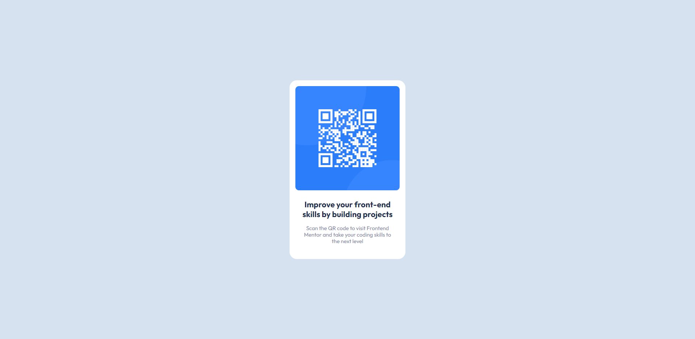
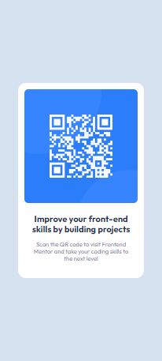

# Frontend Mentor - QR code component solution

This is a solution to the [QR code component challenge on Frontend Mentor](https://www.frontendmentor.io/challenges/qr-code-component-iux_sIO_H). Frontend Mentor challenges help you improve your coding skills by building realistic projects.

## Table of contents

- [Overview](#overview)
  - [Screenshot](#screenshot)
  - [Links](#links)
- [My process](#my-process)
  - [Built with](#built-with)
  - [What I learned](#what-i-learned)
  - [Continued development](#continued-development)
  - [Useful resources](#useful-resources)
- [Author](#author)
- [Acknowledgments](#acknowledgments)

## Overview

### Screenshot

### Links

- Solution URL: [Add solution URL here](https://your-solution-url.com)
- Live Site URL: [Add live site URL here](https://your-live-site-url.com)

## My process

### Built with

- Semantic HTML5 markup
- CSS custom properties
- Flexbox

### What I learned

This is first project in my life so I learned a lot of things but the most important one is I think that,
I learned how to use flex-box and how to center qr code component.

### Continued development

I'll definitely focus more on flex-box and CSS Grid because I need a lot of practice if I want to master them.

### Useful resources

- [A Complete Guide to Flexbox](https://css-tricks.com/snippets/css/a-guide-to-flexbox/) - This helped me a lot ot understand flex-box.

## Author

- LinkedIn - [Darko Mijatovic](https://www.linkedin.com/in/darko-mijatovic-512384231/)
- Frontend Mentor - [@Darko96](https://www.frontendmentor.io/profile/Darko96)
- Instagram - [darkomiijatovic](https://www.instagram.com/darkomiijatovic/)

## Acknowledgments

I want to thank a lot everyone in Frontend Mentor team. Because they made a awsome website where we can practice a lot easier.

Thank you so much for checking my project and Any feedback is highly appreciated.
